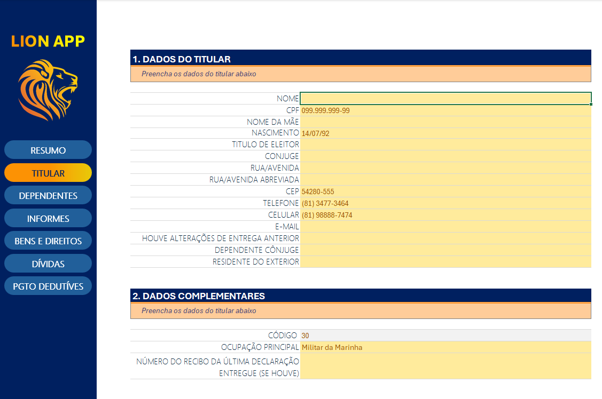
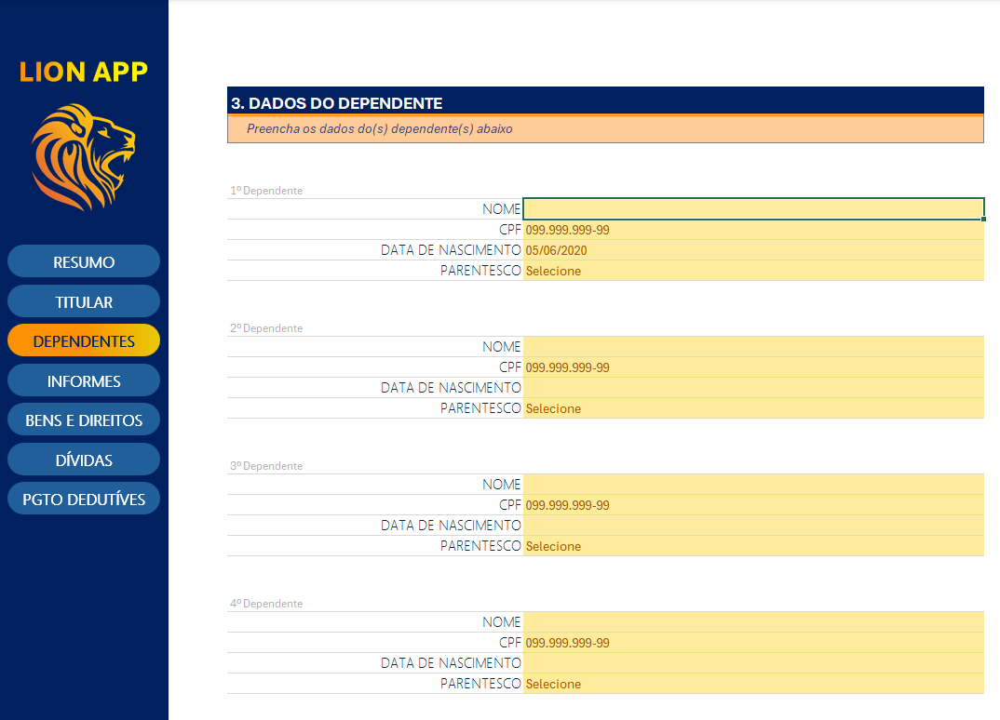
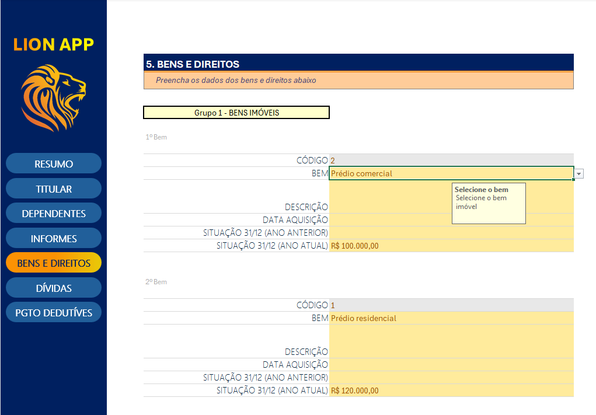

# 📊 Simulador de Declaração do Imposto de Renda no Excel

Este projeto tem como objetivo fornecer uma ferramenta prática e automatizada em **Excel** para auxiliar na organização das informações necessárias à declaração do Imposto de Renda.

A planilha permite o controle de dados pessoais, dependentes, bens, dívidas, rendimentos, pagamentos dedutíveis e muito mais, com validações e resumos automáticos.

---

## Funcionalidades

✅ Cadastro completo de dados pessoais (nome, CPF, endereço, ocupação, etc.)  
✅ Registro de dependentes com CPF e grau de parentesco  
✅ Controle de bens e direitos com situação patrimonial anual  
✅ Registro de dívidas e ônus reais  
✅ Controle de rendimentos por tipo (tributável, isento, exclusivo na fonte)  
✅ Controle de pagamentos dedutíveis (saúde, educação, previdência)  
✅ Resumo geral com totais dos principais itens  

---

## Estrutura da planilha

| Aba                  | Descrição                                                |
|-----------------------|----------------------------------------------------------|
| **Dados Pessoais**     | Informações básicas e complementares do contribuinte     |
| **Dependentes**        | Cadastro dos dependentes da declaração                   |
| **Informes Bancários** | Controle dos saldos em contas bancárias                  |
| **Rendimentos**        | Registro das fontes de rendimento e valores              |
| **Bens e Direitos**    | Controle patrimonial com códigos e valores               |
| **Dívidas e Ônus**     | Registro de dívidas existentes                           |
| **Pagamentos Dedutíveis** | Controle de despesas dedutíveis                     |
| **Resumo Geral**       | Consolidação automática dos principais valores           |
| **Menu**               | Links rápidos de navegação entre as abas                |

---

## Exemplos

📌 **Dados Pessoais**  

📌 **Dependentes**  

📌 **Bens e Direitos**  

---

## ⚙ Como usar

1️⃣ Abra o arquivo Excel no seu computador.  
2️⃣ Preencha as informações em cada aba conforme seu caso.  
3️⃣ Navegue pelas abas usando os links rápidos do menu.  
4️⃣ Verifique o **Resumo Geral** para ter uma visão consolidada.  
5️⃣ Utilize os dados como base para preencher sua declaração no programa da Receita Federal.

---

## 💡 Sobre o projeto

Este projeto foi desenvolvido como parte de um desafio de laboratório para praticar conceitos de Excel e modelagem de informações fiscais.  

Objetivo: criar uma planilha que auxilie o contribuinte a reunir e visualizar suas informações de forma clara e organizada antes da entrega do IR.

---

## 📌 Licença

Este projeto é de uso acadêmico e pessoal. Fique à vontade para adaptar e melhorar.

---

## 📝 Contribuições

Sugestões e melhorias são bem-vindas!
