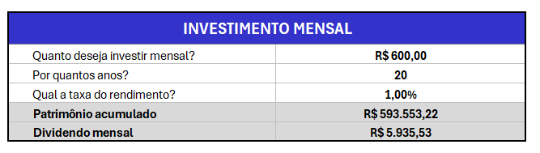
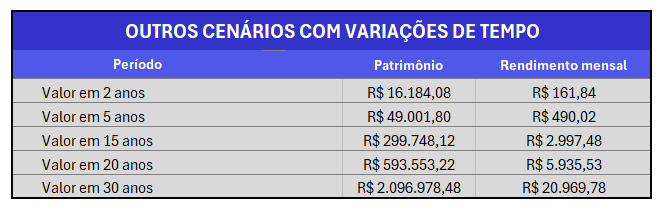
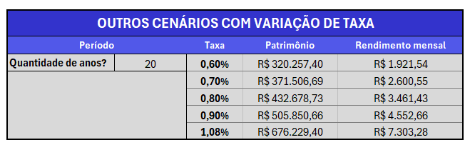
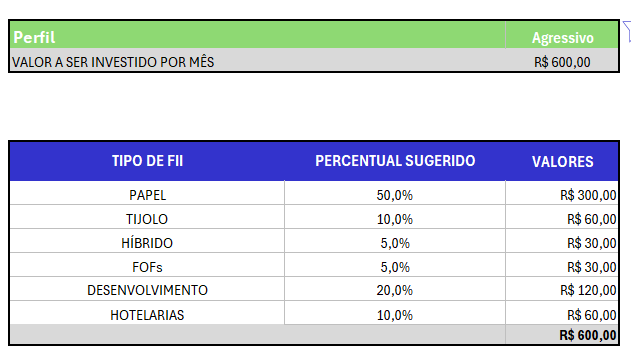

# 📈 Simulador de Fundos Imobiliários (FIIs) em Excel

## 🚀 Visão Geral do Projeto

Este repositório apresenta um simulador desenvolvido no Microsoft Excel para projetar investimentos em fundos imobiliários. A ferramenta inclui quadros interativos para personalizar entradas e visualizar cenários de crescimento do patrimônio.

## ✨ Funcionalidades Principais

A planilha oferece as seguintes funcionalidades para auxiliar seu planejamento financeiro com FIIs:

* **Simulação de Investimento Mensal:**
    * Calcule o **patrimônio acumulado** e o **rendimento mensal** esperado ao longo de um período.
    * Basta informar o valor que deseja investir mensalmente, o número de anos e a taxa de rendimento média esperada.

    

* **Análise de Cenários com Variação de Tempo:**
    * Observe o potencial de crescimento do seu patrimônio e rendimento para diferentes horizontes de tempo (ex: 2, 5, 15, 20, 30 anos), ajudando no planejamento de longo prazo.

    

* **Análise de Cenários com Variação de Taxa de Rendimento:**
    * Explore como diferentes taxas de rendimento impactam seu patrimônio final e seu rendimento mensal, permitindo uma análise de sensibilidade e otimismo/pessimismo.

    

* **Recomendação de Alocação por Perfil de Investidor:**
    * Sugere percentuais e valores de investimento para diferentes tipos de FIIs (Papel, Tijolo, Híbrido, Fundos de Fundos, Desenvolvimento, Hotelarias) com base no perfil de investidor (ex: Agressivo).
    * Permite a visualização de como distribuir seu aporte mensal de acordo com a estratégia sugerida.

    

## 💡 Como Usar

1.  Faça o download do arquivo `Simulador_Investimentos_Fundos_Imobiliarios_Excel.xlsx` neste repositório.
2.  Abra a planilha no Microsoft Excel (ou software compatível).
3.  Preencha os campos solicitados como valor mensal a investir, taxa de rendimento desejada e período.
5.  Visualize os resultados e as projeções automaticamente geradas pela planilha.

## 🛠️ Tecnologias Utilizadas

* **Microsoft Excel:** A planilha utiliza fórmulas e funcionalidades nativas do Excel para realizar todos os cálculos e projeções.

## 🤝 Como Contribuir

Fico muito feliz em receber sugestões e contribuições para este projeto! Se você tem ideias para melhorias, novas funcionalidades, ou identificou algum problema, sinta-se à vontade para:

## 📝 Licença

Este projeto foi desenvolvido para fins educacionais e acadêmicos.

## ✍️ Autor

Desenvolvido por Jaidene Silva.

---
